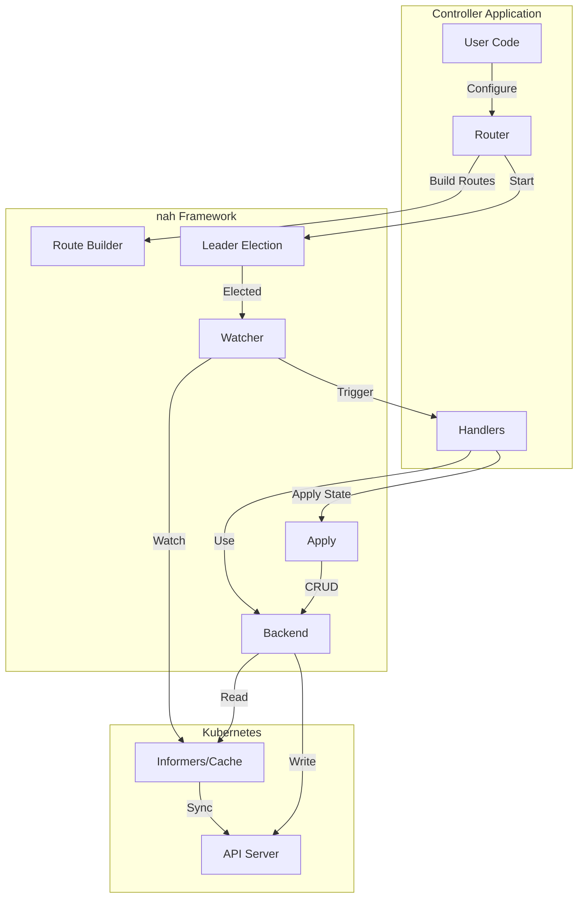
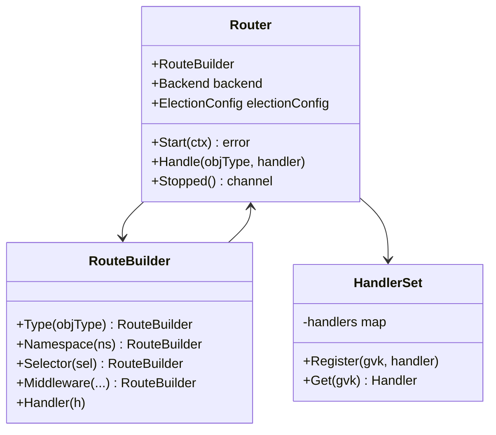
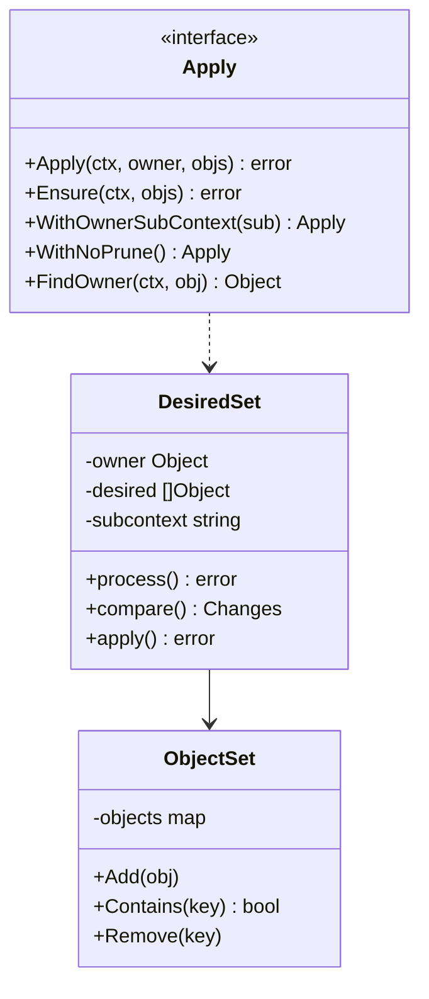
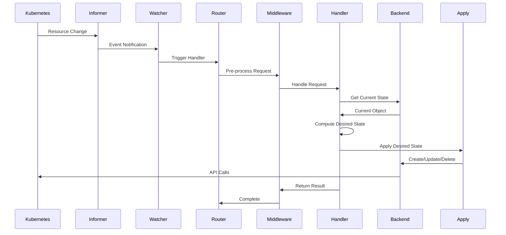
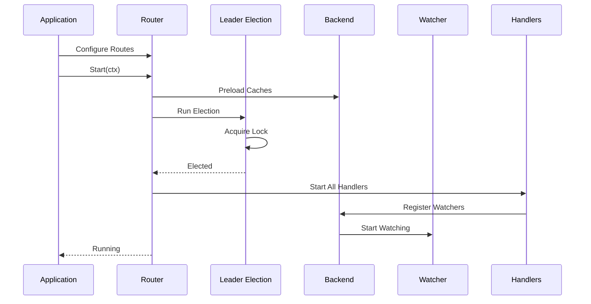
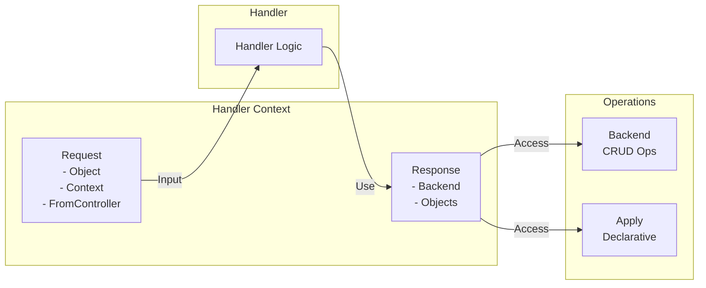
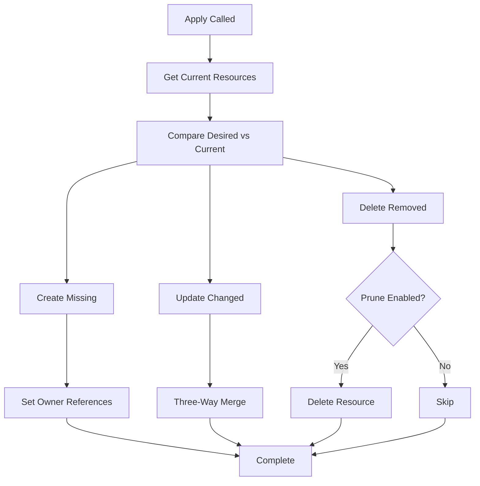
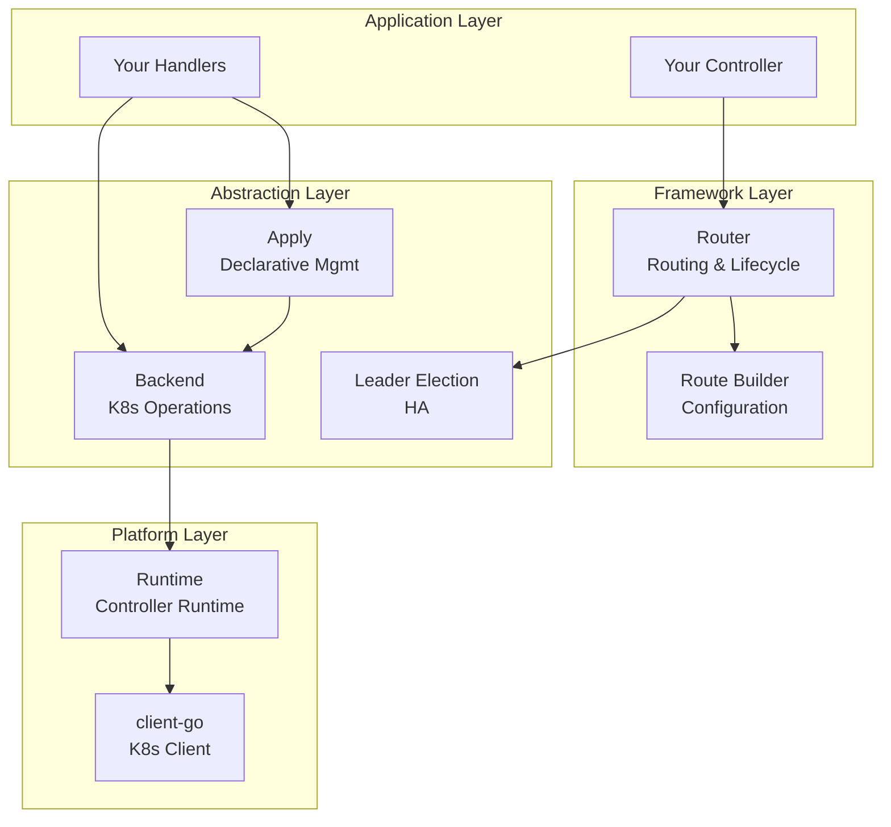
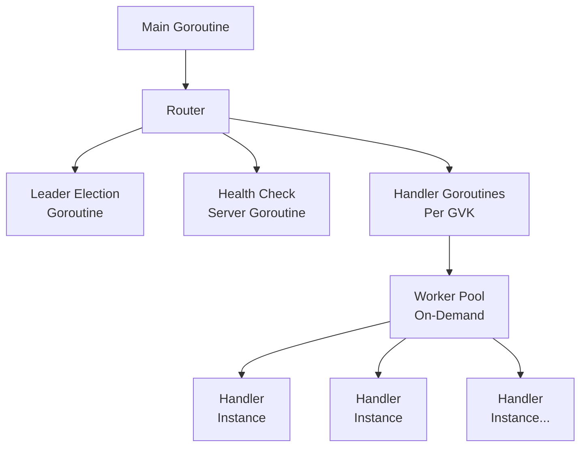

# Architecture Overview

This document provides a comprehensive overview of the nah framework architecture, including component relationships, data flow, and design decisions.

## Table of Contents

- [High-Level Architecture](#high-level-architecture)
- [Core Components](#core-components)
- [Data Flow](#data-flow)
- [Component Interactions](#component-interactions)
- [Design Principles](#design-principles)

---

## High-Level Architecture



**Key Flow:**

1. User configures Router with routes and handlers
2. Router integrates with Leader Election
3. Watcher subscribes to Kubernetes resources via Informers
4. Events trigger appropriate Handlers
5. Handlers use Backend and Apply to reconcile state

---

## Core Components

### Router

The Router is the central orchestrator that:

- Manages controller lifecycle (start, stop)
- Routes Kubernetes events to handlers
- Integrates leader election
- Provides health checks



**Responsibilities:**

- Lifecycle management
- Event routing
- Handler registration
- Leader election integration

### Backend

Backend provides abstraction over Kubernetes operations:

```mermaid
classDiagram
    class Backend {
        <<interface>>
        +Get(ctx, key, obj) error
        +List(ctx, list, opts) error
        +Create(ctx, obj) error
        +Update(ctx, obj) error
        +Delete(ctx, obj) error
        +Trigger(ctx, gvk, key, delay) error
        +Watcher(ctx, gvk, name, cb) error
    }

    class Trigger {
        <<interface>>
        +Trigger(ctx, gvk, key, delay) error
    }

    class Watcher {
        <<interface>>
        +Watcher(ctx, gvk, name, cb) error
    }

    class CacheFactory {
        <<interface>>
        +GetInformerForKind(ctx, gvk) Informer
    }

    Backend --|> Trigger
    Backend --|> Watcher
    Backend --|> CacheFactory
    Backend --|> "client.WithWatch"
```

**Responsibilities:**

- CRUD operations
- Resource watching
- Cache management
- Trigger management

### Apply

Apply provides declarative resource management:



**Responsibilities:**

- Declarative reconciliation
- Owner reference management
- Resource pruning
- Three-way merge patches

---

## Data Flow

### Event Processing Flow



**Steps:**

1. Kubernetes resource changes
2. Informer detects change
3. Watcher triggers appropriate handler
4. Middleware pre-processes request
5. Handler computes desired state
6. Apply reconciles to desired state
7. Backend performs Kubernetes operations

### Startup Flow



**Steps:**

1. Application configures routes
2. Router starts
3. Backend preloads caches
4. Leader election runs
5. After election, handlers start
6. Watchers begin monitoring resources

---

## Component Interactions

### Handler Request/Response Pattern



**Pattern:**

- Request contains resource being processed
- Response provides access to Backend and Apply
- Handler implements business logic
- Middleware wraps handlers

### Apply Workflow



**Workflow:**

1. Retrieve current resources with owner reference
2. Compare desired vs current state
3. Create missing resources
4. Update changed resources (three-way merge)
5. Delete removed resources (if pruning enabled)
6. Set owner references on all managed resources

---

## Design Principles

### 1. Interface-Based Design

Small, focused interfaces enable:

- Easy testing (mocking)
- Flexible implementations
- Clear contracts

```go
type Backend interface {
    // Focused interface
}

type Apply interface {
    // Single responsibility
}
```

### 2. Builder Pattern

Fluent configuration APIs provide:

- Readable code
- Type safety
- Chaining

```go
r.Type(&Pod{}).
    Namespace("default").
    Selector(labels.Set{"app": "myapp"}).
    HandlerFunc(handler)
```

### 3. Declarative Reconciliation

Following Kubernetes principles:

- Declare desired state
- Framework reconciles to desired state
- Idempotent operations
- Level-triggered (not edge-triggered)

### 4. Middleware Pattern

Cross-cutting concerns as middleware:

- Error handling
- Logging
- Metrics
- Authorization

```go
router.Middleware(
    ErrorPrefix("handler"),
    LoggingMiddleware{},
    MetricsMiddleware{},
)
```

### 5. Separation of Concerns

- **Router**: Event routing and lifecycle
- **Backend**: Kubernetes operations
- **Apply**: Declarative state management
- **Leader**: High availability
- **Watcher**: Resource monitoring

Each component has a single, well-defined responsibility.

---

## Layered Architecture



**Layers:**

1. **Application** - Your controller code
2. **Framework** - nah router and builders
3. **Abstraction** - Backend, Apply, Leader
4. **Platform** - controller-runtime, client-go

---

## Performance Optimizations

### 1. On-Demand Workers

Workers spawn only when needed:

- Reduces resource usage
- Scales automatically
- Efficient trigger handling

### 2. Sync.Map for Triggers

Low-contention trigger management:

- Read-heavy workload optimization
- Concurrent access without locks
- Memory-efficient

### 3. Informer Caching

Kubernetes informers provide:

- Local cache for reads
- Watch-based updates
- Reduced API server load

### 4. GVK-Specific Configuration

Per-resource tuning:

- Custom threadiness per GVK
- Queue splitting for high-throughput
- Flexible worker management

---

## Concurrency Model



**Goroutine Usage:**

- Main goroutine manages lifecycle
- Leader election runs in separate goroutine
- Health check server runs in separate goroutine
- Each GVK has worker goroutines (configurable count)
- Workers process events concurrently

---

## See Also

- [Design Patterns](patterns.md) - Detailed pattern explanations
- [Component Deep Dive](components.md) - Per-component documentation
- [ADRs](adr/) - Architecture Decision Records

---

**For Questions:** [GitHub Discussions](https://github.com/obot-platform/nah/discussions)
